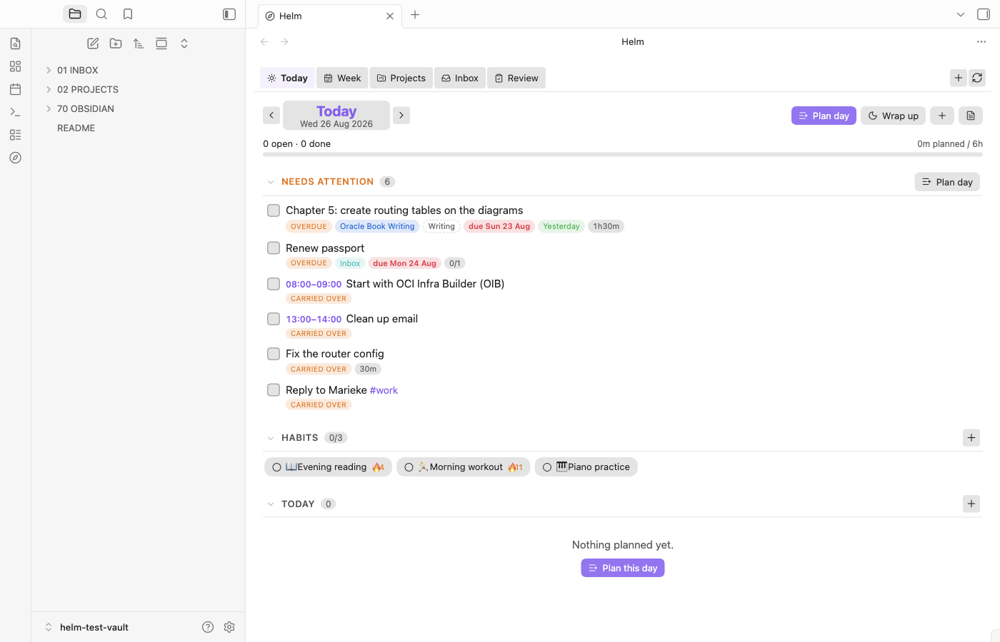
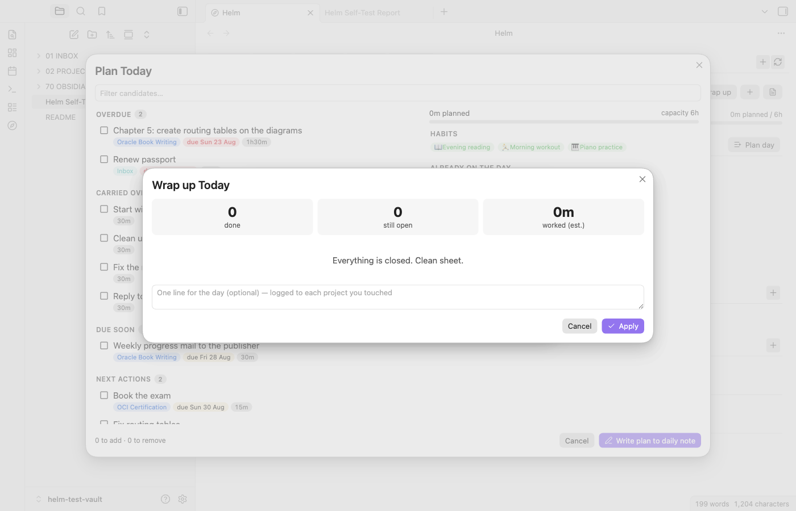
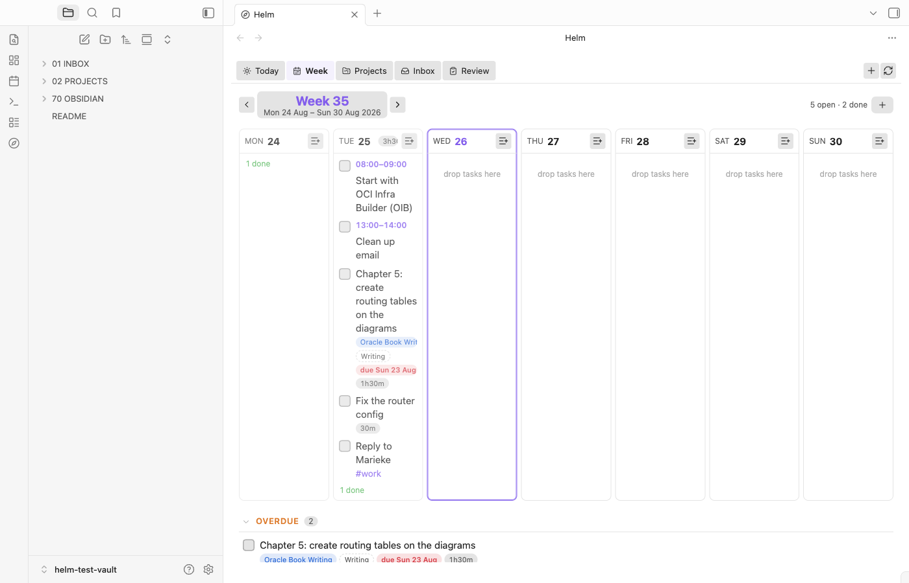
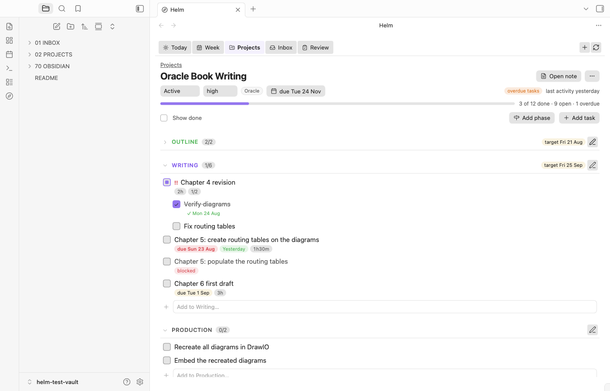
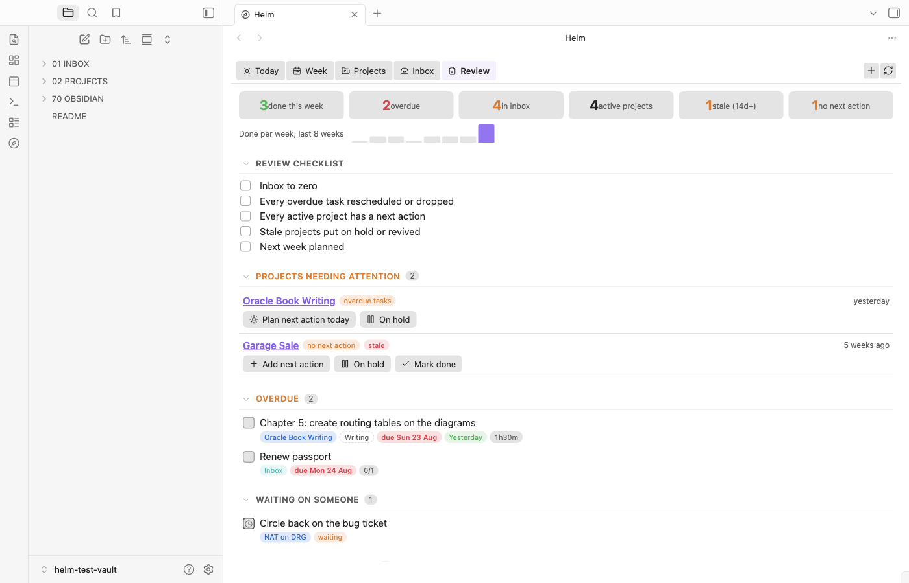
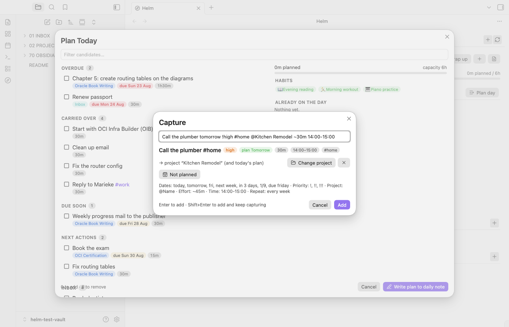

# Helm

**Steer your projects from your daily note.** An Obsidian plugin for projects,
phases, tasks and habits, built around one idea: the day is the unit of work,
and the daily note is where the day lives.

Markdown is the source of truth. Every task is a real `- [ ]` line in a real
note, in the standard Obsidian Tasks emoji format. Uninstall Helm and nothing
breaks — you keep a plain-text task system that other plugins can read.

## The loop

```
   morning              during the day               evening              weekly
┌────────────┐   ┌──────────────────────────┐   ┌──────────────┐   ┌──────────────┐
│  Plan day  │ → │ Capture · tick · reschedule│ → │   Wrap up    │ → │    Review    │
│ pull work  │   │ (Helm view or the note)    │   │ carry forward│   │ health check │
└────────────┘   └──────────────────────────┘   └──────────────┘   └──────────────┘
```

1. **Plan day** — a ranked list of what deserves today (overdue, carried over,
   in progress, due soon, each active project's next action, inbox) against a
   capacity bar. Pick, confirm, and the plan is *written into the daily note*.
2. **Work** — tick boxes in Helm or in the note itself; both are the same line.
   Capture new tasks in one line of natural language. Drag tasks between days.
3. **Wrap up** — decide the fate of every open item (tomorrow, a date, off the
   calendar, done, cancelled). Yesterday's note keeps a `[>]` record of what
   moved; it is a log, not a to-do list that rots.
4. **Review** — weekly: throughput, overdue, inbox, stale projects, projects
   without a next action, habit streaks, what got done by project.

## What it looks like

| Today — the cockpit | Plan day |
|---|---|
|  |  |

| Week (drag between days) | Project detail |
|---|---|
|  |  |

| Review | Capture |
|---|---|
|  |  |

Screenshots are of the seeded test vault (`npm run seed`).

## Calendar — week, month, quarter, year

One tab, four scopes, each a click away from the next: **Year** (done-per-
month chart, four quarter cards with twelve heat-mapped mini months) →
**Quarter** (three months side by side with their goals and projects) →
**Month** (a real grid: planned items per day, ✓ done counts, `!` due-but-
unplanned, week numbers that open the week, drop a task on a day to plan it)
→ **Week** → **Day** (the Today tab). Breadcrumbs `2026 › Q3 › Aug › W35`
jump between levels. Every scope shows the goals and the projects bound to
that period underneath, with inline add/bind.

## Horizons — goals by year, quarter, month, week

Goals live where you already plan the long game: in your **yearly, quarterly,
monthly and weekly notes** (Periodic Notes folders are read automatically).
The whole chain: year → quarter → month → week → day, and goal → project →
phase → task → subtask (nesting is unlimited; it is indentation). A goal is
a checkbox line under `## Goals`:

```markdown
# 2026
## Goals
- [ ] Publish the OCI networking book 🆔 gol-book26
- [x] Set up the home studio 🆔 gol-studio ✅ 2026-06-30
```

A project is **bound to a horizon** and can **serve a goal** through two
frontmatter keys:

```yaml
period: 2026-Q3        # 2026 · 2026-Q3 · 2026-08 · 2026-W35 (also "Q3 2026", "Aug 2026")
goal: gol-book26       # the goal's 🆔, or its text
```

Every task in that project is therefore tied to the quarter (or year, or
month). The **Horizons** tab shows the year card, four quarters and twelve
months with their goals, progress (rolled up from the linked projects' tasks)
and the projects bound to each; add goals inline, bind a project with one
click, or start a new project straight from a goal. Plan day gives a small
boost to tasks from projects bound to the current month/quarter/year, and
Review shows the goals in play.

## Dashboard

Filter by range (7/14/30/90 days, this week/month/quarter/year, custom),
project, area, tag or horizon, then read: done per day and per week,
cumulative flow (captured vs done), plan adherence (what you put on days vs
what got done, and what was carried), done by part of the day, by weekday,
by area, by tag, age of open tasks, projects with velocity and ETA, habit
consistency, goal progress. Every bar, slice and row drills into the tasks
behind it.

## How notes look

**Project** — a folder with a note of the same name. Phases are headings;
their status is derived from their tasks (no callout ceremony):

```markdown
---
title: OCI Networking Book
type: project
id: prj-3f9a2c
status: active          # idea · planned · active · on-hold · done · cancelled · archived
priority: high          # low · normal · medium · high · urgent · critical
area: Oracle
due_date: 2026-12-31
---
# OCI Networking Book

## Phase: Outline 📅 2026-09-15
- [x] Draft chapter list 🆔 tsk-8821 ✅ 2026-08-20
- [/] Collect diagrams ⏫ ⏱️ 2h

## Phase: Writing
- [ ] Chapter 1 📅 2026-09-30 ⏳ 2026-08-27

## Tasks
- [ ] Buy reference books ⏱️ 45m

## Log
- 2026-08-26 — Outline approved.
```

**Daily note** — Helm works *inside your own template*. Any headings named
Morning / Afternoon / Evening (with or without an `A.` prefix), Habits and
Anytime are the plan; typically that is your `# Day planner`. A task is
inserted after the last task of its section, removed with its subtask
lines, or rewritten on its own line — every other byte of the note stays
exactly where it was: your time slots, separators, birthday bullets, quotes.
A section you don't have yet (Habits, Anytime) is created beside its
siblings. No markers, no hidden syntax:

```markdown
# Day planner

### Habits
- [x] 🏃 Morning workout 🆔 hab-0012 ✅ 2026-08-27

### A. Morning

- [ ] 07:00 - 08:00: 
- [ ] 08:00 - 09:00: Start with OIB
- [ ] Chapter 1 🆔 tsk-8822 📅 2026-09-30 🔗 [[OCI Networking Book]]

---
### B. Afternoon

- [ ] 15:00 - 16:00: Search for a plumber
- [ ] Fix router config ⏱️ 30m
```

Only a note with none of those headings gets a small `## Plan` block of its
own (heading configurable).

A line with `🔗 [[Project]]` is a **mirror** of the task in the project note:
same id, same text. Tick it in either place and the other follows. Edit the
text in the project and the mirror is rewritten. Past daily notes are never
rewritten. Which sub-heading a line sits under *is* its part of the day —
drag it on the Today tab, use the context menu, or say "tomorrow evening"
when capturing. Lines in your own day-planner slots (`08:00 - 09:00: …`)
fall into a part by their start time (boundaries are settings).

**Habit** — a note with `type: habit`, a schedule, and nothing else.
Completions are the ticks in daily notes; streaks and rates are computed from
them.

Full details: [`docs/FORMAT.md`](docs/FORMAT.md). Design rationale:
[`docs/DESIGN.md`](docs/DESIGN.md).

## Capture grammar

One line, anywhere (`Helm: Capture a task`, the `+` in the view, or the Inbox):

```
Call the plumber tomorrow !high #home @Kitchen Remodel ~30m 14:00-15:00 due friday every week
```

| Piece | Means |
|---|---|
| `today` `tomorrow` `fri` `next mon` `next week` `in 3 days` `1/9` `12 sep` `eom` `eow` | plan it on that day |
| `due friday` / `by 1/9` | due date 📅 |
| `!` `!!` `!!!` `!!!!` or `!low` `!high` | priority |
| `@Project Name` | goes into that project |
| `~45m` `~2h` | effort estimate ⏱️ |
| `14:00` or `14:00-15:00` | time block |
| `every day` `every week on monday` `weekly` | recurrence 🔁 |
| `#tag` | stays in the text, also indexed |

A capture with a date goes into that day's note. With a project, into the
project (and also the day if dated). With neither, into the inbox note.

## Commands

| Command | |
|---|---|
| Open Helm / Today / Week / Month / Quarter / Year / Projects / Inbox / Review / Horizons / Dashboard | the tabs and calendar scopes |
| Capture a task · Capture a task for today | |
| Plan my day · Wrap up the day | the two rituals |
| Open today’s daily note (create if missing) | |
| New project · New habit | |
| Plan the task under the cursor for today / tomorrow | works in any note Helm indexes |
| Move the task under the cursor to a project… | |
| Add today’s habits to the daily note | |
| Rebuild index | |

`obsidian://helm?tab=today` opens the view from outside; `&action=capture&text=…` pre-fills a capture.

## Settings you will want to check

- **Projects folder** (`02 PROJECTS`), **Habits folder**, **Inbox note**.
- **Daily notes**: Helm follows the Daily Notes / Periodic Notes plugin
  automatically (folder, format, template). Override only if you must.
- **Where the plan goes** in a note that has no region yet: before the first
  heading (default), after a heading you name, or at the end.
- **Daily capacity** and **default effort** drive the capacity bar.
- **Extra folders to scan**: tasks in other notes become plannable; they get
  mirrored into the day with a 🔗 link back to their note.
- **Never index these paths**: archives and old task boards (defaults cover
  `ZZZ. Project Archive`, `999. ARCHIVED TASKS.md`, `90 ARCHIVE`).
- **Horizons**: goals heading (default `## Goals`) and, if you don't use
  Periodic Notes, the yearly/quarterly/monthly folders and formats.

## Development

```bash
npm install
npm test            # vitest: core, data, and jsdom UI tests
npm run build       # typecheck + bundle to ./main.js
npm run seed        # build ~/dev/helm-test-vault (refuses real-looking paths)
npm run dev         # watch-build into the test vault
node scripts/install.mjs "/path/to/vault"   # copy main.js/manifest/styles; never enables
```

Layout: `src/core` (pure parsing/serialising, no Obsidian), `src/data` (index,
planner, mutations — the only writer), `src/ui` (views and modals),
`src/main.ts` (the plugin). `tests/` mirrors it; UI tests render real DOM under
jsdom against an in-memory vault.

In-app: enable **Developer actions** in settings and run **Helm: Run self-test**
— it exercises the whole plan/tick/reschedule/wrap-up path against the live
vault and writes `Helm Self-Test Report.md`.
